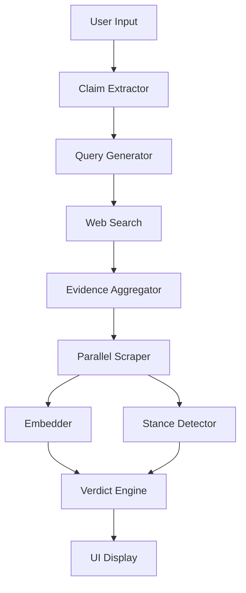

# 📚 Technical Documentation - Fake News Detector

Detailed technical documentation for developers and contributors.

---

## Table of Contents

1. [System Architecture](#system-architecture)
2. [Core Components](#core-components)
3. [Data Flow](#data-flow)
4. [API Reference](#api-reference)
5. [Models & Algorithms](#models--algorithms)
6. [Performance Considerations](#performance-considerations)

---

## 🏛️ System Architecture

### High-Level Overview

```
┌──────────────────────────────────────────────────┐
│                 User Interface                    │
│              (Streamlit Web App)                  │
└─────────────────┬────────────────────────────────┘
                  │
        ┌─────────┴─────────┐
        │                   │
        ▼                   ▼
┌───────────────┐   ┌──────────────┐
│ Claim         │   │  Evidence    │
│ Extraction    │   │  Gathering   │
└───────┬───────┘   └──────┬───────┘
        │                  │
        │    ┌─────────────┘
        │    │
        ▼    ▼
┌──────────────────┐
│ Verdict Engine   │
└────────┬─────────┘
         │
         ▼
┌──────────────────┐
│   UI Display     │
└──────────────────┘
```

### Component Diagram



---

## 🧩 Core Components

### 1. Claim Extractor (`claim_extractor.py`)

**Purpose:** Extract the main claim from text or URL

**Key Functions:**

#### `extract_text_from_url(url: str) -> str`
Fetches and extracts clean text from a URL using trafilatura.

**Parameters:**
- `url`: URL of the article

**Returns:**
- Cleaned article text or empty string

**Algorithm:**
1. Fetch HTML using trafilatura
2. Extract main content (removes ads, navigation)
3. Return cleaned text

#### `extract_claim_from_text(text: str) -> str`
Extracts the main claim (first meaningful sentence).

**Parameters:**
- `text`: Article text

**Returns:**
- Extracted claim (first sentence >20 chars)

**Algorithm:**
1. Clean and normalize text
2. Use Spacy for sentence segmentation
3. Return first meaningful sentence (>20 chars)
4. Use KeyBERT for keyword extraction (metadata)

**Models Used:**
- Spacy `en_core_web_sm`
- KeyBERT

---

### 2. Query Generator (`query_generator.py`)

**Purpose:** Generate multiple search queries from a claim

**Key Functions:**

#### `generate_queries(claim: str) -> list`
Generates diverse search queries for better evidence coverage.

**Parameters:**
- `claim`: The claim to fact-check

**Returns:**
- List of unique search query strings

**Algorithm:**
1. Extract named entities using Spacy
2. Generate base queries:
   - Original claim
   - "{claim} fact check"
   - "{claim} true or false"
   - "{claim} hoax"
   - "{claim} authenticity check"
3. For each entity, generate:
   - "{entity} {claim}"
   - "{claim} {entity} false"
   - "{entity} controversy"
   - "{entity} news verification"
4. Deduplicate using set

**Example:**
```python
Input: "COVID-19 vaccines cause autism"
Output: [
    "covid-19 vaccines cause autism",
    "covid-19 vaccines cause autism fact check",
    "COVID-19 covid-19 vaccines cause autism",
    "vaccines controversy",
    ...
]
```

---

### 3. Web Search (`web_search.py`)

**Purpose:** Search the web using DuckDuckGo

**Key Functions:**

#### `web_search(queries: List[str], max_results: int = 6) -> List[Dict]`
Searches multiple queries and returns deduplicated results.

**Parameters:**
- `queries`: List of search queries
- `max_results`: Max results per query

**Returns:**
- List of `{href, title, body}` dictionaries

**Algorithm:**
1. Initialize DDGS client
2. For each query:
   - Search with DuckDuckGo
   - Collect results
   - Deduplicate by URL
   - Add 0.5s delay (rate limiting)
3. Return all unique results

**API:** DuckDuckGo Text Search API

**Rate Limiting:** 0.5s delay between queries

---

### 4. Scraper (`scraper.py`)

**Purpose:** Extract article content from URLs

**Key Functions:**

#### `scrape_article(url: str) -> str`
Scrapes and extracts main article text.

**Parameters:**
- `url`: Article URL

**Returns:**
- Article text or empty string

**Algorithm:**
1. Fetch HTML using trafilatura
2. Extract main content
3. Return cleaned text
4. Handle errors gracefully

**Libraries:** trafilatura (fast, accurate extraction)

---

### 5. Embedder (`embedder.py`)

**Purpose:** Compute semantic similarity between claim and evidence

**Key Functions:**

#### `get_best_matching_sentence(claim: str, sentences: list) -> tuple`
Finds the sentence most semantically similar to the claim.

**Parameters:**
- `claim`: The claim being fact-checked
- `sentences`: List of candidate sentences

**Returns:**
- `(best_sentence, best_score, all_scores)`

**Algorithm:**
1. Encode claim using SBERT
2. Encode all sentences using SBERT
3. Compute cosine similarity
4. Return sentence with highest similarity

**Model:** `sentence-transformers/all-mpnet-base-v2`
- 768-dimensional embeddings
- Trained on 1 billion sentence pairs
- SOTA performance on semantic similarity

**Mathematical Formula:**
```
similarity = cosine_sim(embed(claim), embed(sentence))
           = (A · B) / (||A|| × ||B||)
```

---

### 6. Stance Detector (`stance_detector.py`)

**Purpose:** Determine if evidence supports/refutes/discusses a claim

**Key Functions:**

#### `detect_stance(evidence_sentence: str, claim: str) -> dict`
Detects the stance of evidence toward the claim.

**Parameters:**
- `evidence_sentence`: Sentence from article
- `claim`: The claim being checked

**Returns:**
- `{"label": str, "confidence": float}`
- Labels: "supports", "refutes", "discusses"

**Algorithm:**
1. Format as NLI task (premise-hypothesis)
2. Use BART-large-MNLI for zero-shot classification
3. Classify into: supports/refutes/neutral
4. Map "neutral" to "discusses"

**Model:** `facebook/bart-large-mnli`
- Zero-shot classification
- Natural Language Inference
- 3-way classification

**Hypothesis Template:**
```
"This supports the claim that {claim}."
```

---

### 7. Evidence Aggregator (`evidence_aggregator.py`)

**Purpose:** Aggregate evidence from multiple sources in parallel

**Key Functions:**

#### `build_evidence(claim: str, search_results: list, max_workers: int = 5) -> list`
Processes search results in parallel to extract evidence.

**Parameters:**
- `claim`: The claim being fact-checked
- `search_results`: List of search result dicts
- `max_workers`: Number of parallel workers

**Returns:**
- List of evidence dictionaries

**Algorithm:**
1. Create ThreadPoolExecutor with N workers
2. For each URL (in parallel):
   - Scrape article
   - Split into sentences
   - Find best matching sentence
   - Detect stance
3. Collect all results
4. Return evidence list

**Parallel Processing:**
- Uses `concurrent.futures.ThreadPoolExecutor`
- Default 5 workers
- 60-70% faster than sequential

**Evidence Structure:**
```python
{
    "url": str,
    "best_sentence": str,
    "similarity": float (0-1),
    "stance": str ("supports"|"refutes"|"discusses"),
    "stance_score": float (0-1)
}
```

---

### 8. Verdict Engine (`verdict_engine.py`)

**Purpose:** Compute final verdict from all evidence

**Key Functions:**

#### `compute_weighted_score(evidence: dict) -> float`
Computes weighted score for a single piece of evidence.

**Formula:**
```python
score = similarity × stance_score × stance_weight × source_weight

where:
  stance_weight = +1 (supports) | -1 (refutes) | 0 (discusses)
  source_weight = 1.0 (default, can be adjusted)
```

#### `compute_final_verdict(evidences: list) -> dict`
Aggregates all evidence and makes final decision.

**Parameters:**
- `evidences`: List of evidence dictionaries

**Returns:**
```python
{
    "verdict": str,      # LIKELY TRUE | LIKELY FALSE | MIXED / MISLEADING | UNVERIFIED
    "confidence": float, # 0-1
    "net_score": float   # sum of all weighted scores
}
```

**Algorithm:**
1. If no evidence → UNVERIFIED
2. Compute weighted score for each evidence
3. Sum all scores → net_score
4. Apply sigmoid to |net_score| → confidence
5. Threshold-based decision:
   - net_score > 0.4 → LIKELY TRUE
   - net_score < -0.4 → LIKELY FALSE
   - else → MIXED / MISLEADING

**Sigmoid Function:**
```python
sigmoid(x) = 1 / (1 + e^(-x))
```

**Decision Thresholds:**
```
-∞ ←──── -0.4 ←──── 0 ────→ 0.4 ────→ +∞
   FALSE      MIXED     MIXED     TRUE
```

---

## 📊 Data Flow

### Complete Pipeline

```
1. INPUT
   ├─ URL → extract_text_from_url()
   ├─ Text → (direct)
   └─ Claim → (direct)
          ↓
2. CLAIM EXTRACTION
   extract_claim_from_text()
   → First meaningful sentence
          ↓
3. QUERY GENERATION
   generate_queries()
   → ["query1", "query2", ...]
          ↓
4. WEB SEARCH
   web_search()
   → [{"href": url, "title": ..., "body": ...}, ...]
          ↓
5. EVIDENCE GATHERING (PARALLEL)
   For each URL:
     ├─ scrape_article()
     ├─ split_into_sentences()
     ├─ get_best_matching_sentence()
     └─ detect_stance()
   → [{"url": ..., "similarity": ..., "stance": ...}, ...]
          ↓
6. VERDICT COMPUTATION
   compute_final_verdict()
   → {"verdict": ..., "confidence": ..., "net_score": ...}
          ↓
7. OUTPUT
   Display in UI with evidence breakdown
```

---

## 📈 Performance Characteristics

### Time Complexity

| Operation | Complexity | Typical Time |
|-----------|------------|--------------|
| Claim extraction | O(n) | <1s |
| Query generation | O(n×e) | <1s |
| Web search | O(q×r) | 5-10s |
| Scraping (sequential) | O(u) | 20-30s |
| Scraping (parallel) | O(u/w) | 5-8s |
| Embedding | O(n×d) | 1-2s |
| Stance detection | O(u) | 5-10s |
| Verdict | O(u) | <0.1s |

*where: n=text length, e=entities, q=queries, r=results, u=URLs, w=workers, d=embedding dim*

### Space Complexity

| Component | Memory Usage |
|-----------|--------------|
| SBERT model | ~500 MB |
| BART-NLI model | ~1.6 GB |
| Spacy model | ~50 MB |
| Running app | ~2.5 GB total |

---

## 🔬 Models & Algorithms

### SBERT (Sentence-BERT)

**Model:** `sentence-transformers/all-mpnet-base-v2`

**Architecture:**
- Based on MPNet (Masked and Permuted Pre-training)
- 12 layers, 768 hidden units
- Mean pooling
- Cosine similarity

**Training:**
- 1 billion sentence pairs
- Optimized for semantic similarity
- Multiple datasets (NLI, QQP, etc.)

**Performance:**
- State-of-the-art on STS benchmark
- 85.5% Spearman correlation

### BART-MNLI

**Model:** `facebook/bart-large-mnli`

**Architecture:**
- BART: Denoising autoencoder
- 12 encoder + 12 decoder layers
- Fine-tuned on MNLI dataset

**Task:**
- Natural Language Inference
- 3-way classification: entailment/contradiction/neutral

**Accuracy:**
- 90.5% on MNLI matched
- 90.1% on MNLI mismatched

---

## 🚀 Performance Optimization

### Current Optimizations

1. **Parallel Scraping**
   - 5 concurrent workers
   - ThreadPoolExecutor
   - 60-70% speedup

2. **Model Caching**
   - Models loaded once at startup
   - Cached in memory

3. **Efficient NLP**
   - Limit text to 3000 chars for claim extraction
   - Limit to 100K chars for sentence splitting

### Potential Optimizations

1. **Batch Processing**
   ```python
   # Instead of 1-by-1
   for sentence in sentences:
       embedding = model.encode(sentence)
   
   # Batch encode
   embeddings = model.encode(sentences, batch_size=32)
   ```

2. **Result Caching**
   ```python
   # Cache verdicts for repeated claims
   @lru_cache(maxsize=1000)
   def cached_verdict(claim: str) -> dict:
       ...
   ```

3. **GPU Acceleration**
   ```python
   # Use GPU if available
   device = 0 if torch.cuda.is_available() else -1
   classifier = pipeline(..., device=device)
   ```

---

## 🧪 Testing

### Unit Tests Example

```python
# test_verdict_engine.py
import pytest
from app.core.verdict_engine import compute_final_verdict

def test_verdict_with_supporting_evidence():
    evidences = [{
        "similarity": 0.8,
        "stance": "supports",
        "stance_score": 0.9,
        "source_weight": 1.0
    }]
    result = compute_final_verdict(evidences)
    assert result["verdict"] == "LIKELY TRUE"
    assert result["confidence"] > 0.5

def test_verdict_with_no_evidence():
    result = compute_final_verdict([])
    assert result["verdict"] == "UNVERIFIED"
    assert result["confidence"] == 0.0
```

---

## 📚 References

1. **Sentence-BERT**: Reimers & Gurevych (2019)
2. **BART**: Lewis et al. (2020)
3. **MNLI**: Williams et al. (2018)
4. **Spacy**: Honnibal & Montani (2017)

---

**Documentation version:** 1.0  
**Last updated:** 2024
