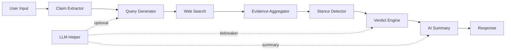

# 🔍 VeriFact

**AI-Powered Claim Verification System using NLP and Machine Learning**

[](https://github.com/AdetyaJamwal04/Fake_News_Detection/actions/workflows/deploy.yml)
[](https://opensource.org/licenses/MIT)
[](https://www.python.org/downloads/)

## Overview

A production-ready claim verification system that fact-checks claims using web evidence, local ML models, and optional LLM reasoning. All core ML inference runs locally — no external ML API dependencies required.

### How It Works

1. **Extract claims** from text or URLs using spaCy NLP
2. **Generate search queries** via LLM decomposition (Groq) or NER-based fallback
3. **Search the web** for evidence (Tavily → Brave → DuckDuckGo fallback chain)
4. **Scrape & embed** article content, rank by semantic similarity (SBERT)
5. **Detect stance** using local NLI model (DeBERTa-v3)
6. **Compute verdict** with weighted credibility scoring + optional LLM tiebreaker
7. **Generate AI summary** — plain-language explanation of the verdict (Groq LLM)

## 🏗️ Architecture



### Core Modules

| Module | Description |
|--------|-------------|
| `claim_extractor` | Extracts claims from text/URLs using spaCy + sentence scoring |
| `query_generator` | Generates search queries via LLM decomposition or NER fallback |
| `web_search` | Multi-API search with fallback chain (Tavily → Brave → DuckDuckGo) |
| `scraper` | Fetches and cleans article content via trafilatura |
| `embedder` | Sentence embeddings using local SBERT (all-MiniLM-L6-v2) |
| `stance_detector` | NLI-based stance classification using local DeBERTa-v3 |
| `source_scorer` | Credibility weighting for sources (trusted, standard, social media) |
| `evidence_aggregator` | Scrapes, embeds, and ranks evidence with multi-threaded processing |
| `verdict_engine` | Final verdict with confidence scores and structured explanation |
| `llm_helper` | Groq LLM integration for query decomposition, tiebreaking, and AI summaries |
| `model_registry` | Thread-safe singleton management for all local ML models |

## 🚀 Quick Start

### Using Docker (Recommended)

```bash
docker pull adetyajamwal/fake-news-detector:latest
docker run -d -p 5000:5000 --name verifact \
  -e TAVILY_API_KEY=your_key \
  -e GROQ_API_KEY=your_key \
  adetyajamwal/fake-news-detector:latest
```

### Local Development

```bash
# Clone and install
git clone https://github.com/AdetyaJamwal04/Fake_News_Detection.git
cd Fake_News_Detection
pip install -r requirements.txt
python -m spacy download en_core_web_sm

# Run
python app_flask.py
```

Visit `http://localhost:5000` to use the web UI.

## 📡 API Reference

### Check a Claim

```bash
POST /api/check
Content-Type: application/json

{
  "claim": "The Earth is flat",
  "max_results": 3
}
```

**Response:**
```json
{
  "claim": "The Earth is flat",
  "verdict": "LIKELY FALSE",
  "confidence": 0.92,
  "net_score": -1.45,
  "summary": "Multiple credible sources including NASA and scientific journals confirm Earth is an oblate spheroid. No evidence supports the flat Earth claim.",
  "explanation": { "steps": [...], "breakdown": {...} },
  "evidences": [...],
  "sources_analyzed": 3,
  "processing_time": 12.5,
  "status": "success"
}
```

### Verdict Types

| Verdict | Meaning |
|---------|---------|
| `LIKELY TRUE` | Evidence strongly supports the claim |
| `LIKELY FALSE` | Evidence strongly contradicts the claim |
| `MIXED / MISLEADING` | Conflicting or insufficient evidence |
| `UNVERIFIED` | No relevant evidence found |

### Endpoints

| Endpoint | Method | Description |
|----------|--------|-------------|
| `/` | GET | Web UI |
| `/api/health` | GET | Health check with model status and metrics |
| `/api/check` | POST | Fact-check a claim |
| `/warmup` | POST | Pre-load all ML models |

## ⚙️ Configuration

### Environment Variables

| Variable | Required | Description |
|----------|----------|-------------|
| `TAVILY_API_KEY` | Yes | Primary search API key |
| `GROQ_API_KEY` | No | Enables LLM features (AI summary, query decomposition, tiebreaker) |
| `HF_API_TOKEN` | No | HuggingFace API token for keyword extraction |
| `PORT` | No | Server port (default: 5000) |
| `DEBUG` | No | Debug mode (default: false) |

> **Note:** The system works without `GROQ_API_KEY` — it falls back to NER-based queries and rule-based explanations. Groq enhances accuracy but is not required.

## 🧠 Models

All core ML models run **locally** on CPU — no GPU required.

| Model | Purpose | Size | Source |
|-------|---------|------|--------|
| `nli-deberta-v3-small` | Stance detection (NLI) | ~180 MB | HuggingFace |
| `all-MiniLM-L6-v2` | Sentence embeddings (SBERT) | ~90 MB | HuggingFace |
| `en_core_web_sm` | Tokenization + NER | ~12 MB | spaCy |
| `llama-3.3-70b-versatile` | LLM reasoning (optional) | API-based | Groq |

Models are lazy-loaded on first request. Use `/warmup` to pre-load them.

## 🧪 Testing

```bash
pytest tests/ -v
```

| Test File | Coverage |
|-----------|----------|
| `test_verdict_engine.py` | Verdict computation, scoring, thresholds |
| `test_llm_summary.py` | AI summary generation, fallbacks |
| `test_claim_extractor.py` | Claim extraction from text/URLs |
| `test_query_generator.py` | Query generation strategies |
| `test_source_scorer.py` | Source credibility weighting |
| `test_web_search.py` | Search API fallback chain |
| `test_integration.py` | End-to-end pipeline |

## 🛠️ Tech Stack

- **Backend:** Flask, Gunicorn, WhiteNoise
- **NLI Model:** DeBERTa-v3-small (cross-encoder, local inference)
- **Embeddings:** Sentence-Transformers / all-MiniLM-L6-v2 (local)
- **NLP:** spaCy (NER, tokenization)
- **LLM:** Groq API / Llama-3.3-70b (optional, for summaries + tiebreaking)
- **Search:** Tavily (primary), Brave Search, DuckDuckGo (fallback)
- **Scraping:** trafilatura
- **Deployment:** Docker, GitHub Actions CI/CD, AWS EC2

## 📄 License

MIT License — see [LICENSE](LICENSE) for details.

## 👤 Author

**Adetya Jamwal**
- GitHub: [@AdetyaJamwal04](https://github.com/AdetyaJamwal04)
